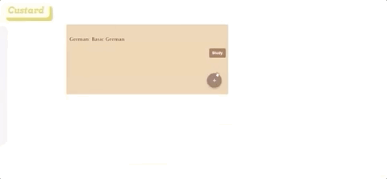
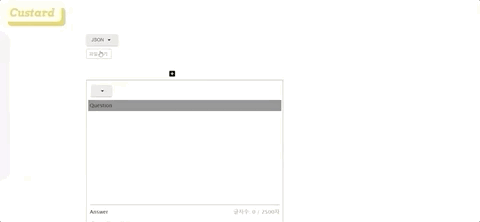
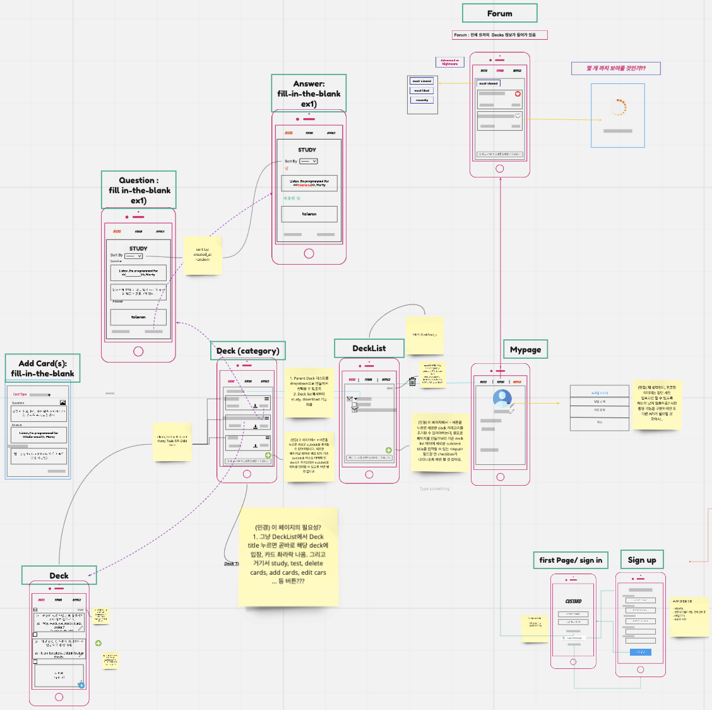
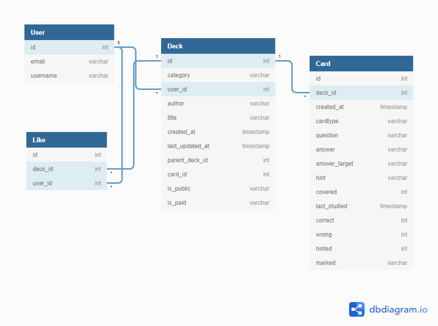

### 개인 프로젝트로 리팩토링 했습니다😀

🔗 GitHub: https://github.com/YounglanHong/FinalProject_Deploy

***

# 팀명: Andamiro 🙏

### 팀 소개

| Member   |     Role      |  GitHub |
|:----------|:-------------:|:------:|
|이민경|Front-End|[gooogyeong](https://github.com/gooogyeong)|
|홍영란|Front-End|[YounglanHong](https://github.com/YounglanHong)|
|김정수|Back-End|[ilmaticboy](https://github.com/ilmaticboy)|
|박성용|Back-End|[Woody-Park](https://github.com/Woody-Park)|


***
# 프로젝트명: Custard 🍮
 

## 프로젝트 정보
### 0. 소개
미드, 단어장, 전공서적, 신문 기사, 어떤 정보든 나만의 교재로 만드는 커스텀 플래시카드 웹 어플리케이션입니다.

### 1. 설치 및 사용 방법

(1) 코드 복사

> 본 레파지토리를 https://github.com/YounglanHong/FinalProject_Custard.git 주소를 활용하여 로컬 환경에 clone 합니다. 
```
git clone https://github.com/YounglanHong/FinalProject_Custard.git
```
(2) 패키지 설치
```
npm install
```
(3) 실행
```
// Custard-client 
cd client
npm start

// Custard-server
npm start
```

***

### 2. 디렉토리 구조
<details>
<summary>Custard-client</summary>
     
```
├── src/
     └── components/
     |    ├──  Login/                      
     |    ├──  Signup/                
     |    ├──  Mypage/                     
     |    ├──  AllDeckList/                     
     |    ├──  Deck/                 
     |    ├──  Card/                   
     |    ├──  AddCard/                      
     |    ├──  Blank/                         
     |    ├──  Flashcard/                       
     |    ├──  Study/                   
     |    ├──  Score/                   
     |    └── root/       
     |         ├──  LoginRoot/   
     |         ├──  SignupRoot/ 
     |         └──  MypageRoot/    
     |    └──  selectMenu/               - menu list 기능
     |    └──  speedDial/                - speed dial 기능
     |    └──  textType/                 - AddCard에 필요한 함수들
     |
     ├── containers/
     |    ├──  Login/                      
     |    ├──  Signup/                
     |    ├──  Mypage/                     
     |    ├──  AllDeckList/                     
     |    ├──  Deck/                             
     |    ├──  AddCard/                      
     |    ├──  Blank/                         
     |    ├──  Flashcard/                       
     |    ├──  Study/                   
     |    └──  Score/                      
     |
     ├── actions/
     |    ├── allDeckListActions/                
     |    ├── cardActions/                       
     |    └── myPageActions/                 
     |
     ├── reducers/
     |    ├── cardReducer/                
     |    ├── deckReducer/               
     |    ├── mypageReducer/                           
     |    └── rootReducer/                 
     |
     ├── styles/                     - 주요 component css 파일
     ├── App                             
     ├── App.css                          
     └── index                            
```
</details>

<details>
<summary>Custard-server</summary>
     
```
└── controller/
     └── cards/
     |    ├──  index/                      
     |    ├──  card/                
     |    ├──  hinted/                     
     |    ├──  marked/                     
     |    ├──  update_card/                 
     |    ├──  correct/                             
     |    └──  wrong/       
     └── decks/
     |    ├──  category/                      
     |    ├──  deck/                
     |    ├──  index/                     
     |    ├──  update_cate/                                              
     |    └──  update_deck/   
     └── user/
     |    ├──  index/                      
     |    ├──  login/                
     |    ├──  profile/                     
     |    ├──  signout/                                              
     |    └──  signup/ 
     |
     ├── index/
     |
     ├── models/
     |    ├──  index/   
     |    ├──  Card/                      
     |    ├──  Category/                
     |    ├──  Deck/                     
     |    ├──  User/                                      
     |    └──  Like/                      
     |
     ├── routes/
     |    ├── cards/                
     |    ├── decks/                       
     |    └── users/                 
     |                          
     └── app                          
```

</details>

***

### 3. 주요 기능 
<details>
<summary>구글 소셜 로그인 & 프로필 이미지 추가</summary>

</details>

<details>
<summary>category & deck 추가/삭제</summary>


</details>

**텍스트 타입 별 카드 추가**
<details>
<summary>일반 텍스트 형식</summary>

</details>

<details>
<summary>표 형식</summary>

</details>

<details>
<summary>JSON 형식</summary>

</details>

<details>
<summary>이미지 텍스트 인식(OCR)</summary>

</details>

<details>
<summary>카드 학습 & 점수보기</summary>

</details>

***
  
### 4. 사용 스택
#### Front-End
* React & Redux
* TOAST-UI
* Tesseract.js
* Material-UI

#### Back-End
* Node.js & Express
* JWT
* MySQl
* Sequelize

#### Deployment
* AWS - S3
* AWS - EC2
* AWS - RDS

***

## 5. UI flow

🔗 [UI Flow](https://miro.com/app/board/o9J_kug6NV0=/)




## 6. DB Schema




