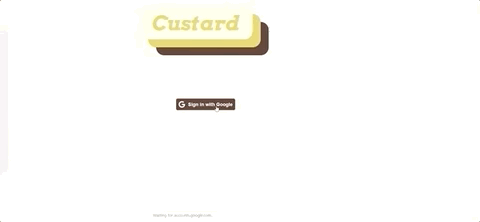
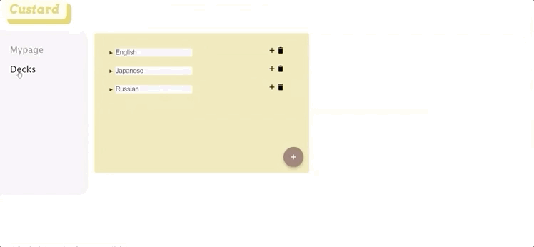
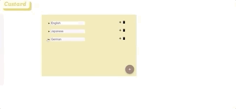
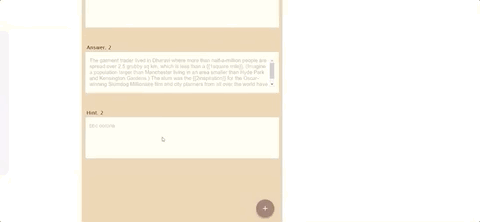

# 프로젝트명: Custard 🍮

## 프로젝트 정보
### 1. 소개
미드, 단어장, 전공서적, 신문 기사, 어떤 정보든 나만의 교재로 만드는 커스텀 플래시카드 웹 어플리케이션입니다.

※ 배포 링크 :  http://custard-client.s3-website.ap-northeast-2.amazonaws.com/

### 2. 주요 기능
* 구글 소셜 로그인

* category & deck 추가/삭제

* 텍스트 타입 별 카드 추가
  - 일반 텍스트
  2.gif)
  - 표 형식
  .gif)
  - JSON 형식
  .gif)
  - 이미지 텍스트 인식
  .gif)
  2.gif)
* 카드 학습 & 점수보기  

  
### 3. 사용 스택
#### Front-End
* React & Redux
* TOAST-UI
* Tesseract.js
* Material-UI

#### Back-End
* Node.js & Express
* JWT
* MySQl
* Sequelize

#### Deployment
* AWS - S3
* AWS - EC2
* AWS - RDS

***
# 팀명: Andamiro 🙏
### 팀 소개
[Front-End]
* (팀장) 이민경
* 홍영란

[Back-End]
* 김정수
* 박성용

***

